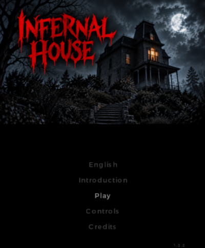
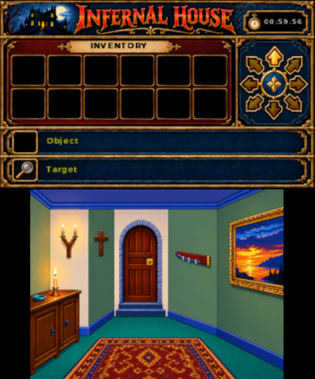
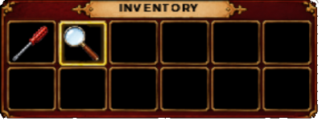
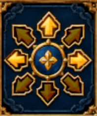
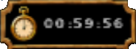
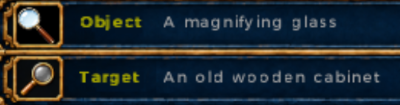

# How to Play — Infernal House 3DS

This guide explains **how to play Infernal House 3DS**, without revealing the solutions to the puzzles. It assumes that the game is already installed and that you have reached the title screen.

For instructions on installing the `.cia` or `.3dsx` file, see the [project README](../README.md).

> **Before you start**
>
> A game lasts at most **60 minutes**. You can save at any time while exploring with the **START** button (see [Saving and resuming a game](#10-saving-and-resuming-a-game)). Quitting the game without saving loses your progress since the last save.
>
> Some bad decisions can also be fatal. *Infernal House* is a game of exploration and experimentation: observe, try things, and don't be surprised if an apparently brilliant idea turns out to be a rather bad one.

## 1. The title screen

The title screen offers the following choices:

- **Language**: switches to the next language. The change is immediate.
- **Continue**: resumes the saved game. This choice only appears if a save exists.
- **Introduction**: tells the events leading up to the game. Watching it at least once is strongly recommended.
- **New game**: starts a new game. **Warning: the existing save is then erased.**
- **Controls**: displays a reminder of the main controls.
- **Credits**: displays the credits for the original game and the remake.

You can move through the menu with **up/down** on the D-Pad or Circle Pad, then confirm with **A**.

You can also touch an option directly on the touch screen.

On the **Controls** and **Credits** pages, press **A**, **B**, or touch the screen to return to the menu.

### During the introduction

The introduction plays automatically.

- **A** speeds things up: if text is still being displayed, it appears immediately and the sequence continues. During a pause, **A** continues the sequence.
- **B** abandons the introduction and returns to the title screen.

The introduction does not count towards the 60-minute time limit.

## 2. The two screens

The 3DS is used like a small two-level adventure console:

- **the bottom screen** represents the room you are currently in. This is where you touch furniture, objects and elements of the scenery;
- **the top screen** contains all the useful information: inventory, selected item, current target, available exits and remaining time.

### The inventory

Items you pick up appear in the inventory at the top of the screen.

A frame indicates the currently selected item. Its name is also displayed in the **Item** area.

Use the **D-Pad** to browse the inventory:

- left/right selects the previous or next item;
- up/down moves between rows when the inventory contains enough items.

### The target

When you touch an interactive element in a room, it becomes your **target**. Its name appears in the **Target** area on the top screen.

This is important when you want to use an item: the game needs to know **which item from your inventory** you want to use and **what** you want to use it on.

### Directions

The arrows on the right side of the top screen show the directions in which you can currently move.

They can point north, south, east, west or diagonally.

If an arrow is not displayed, you cannot move in that direction at the moment. Some actions may, however, open new passages.

### The timer

The counter at the top of the screen shows the remaining time. A new game starts with **60 minutes**.

Time continues to pass while you explore, read messages, examine your items or solve mini-games.

However, time spent in the HOME Menu, in the START menu or while the console is in sleep mode is not counted.

When the timer reaches zero, the game is over.

## 3. Moving around the house

Use the **Circle Pad** in the direction you want to go.

The game recognizes eight directions: up, down, left, right and the four diagonals.

One movement of the Circle Pad corresponds to **one move**. Holding the Circle Pad in a direction will therefore not make you cross several rooms at once: release it before moving again.

Look at the direction arrows on the top screen if you are not sure which exits are available.

## 4. Examining and interacting with the scenery

The touch screen is at the heart of the game.

Touch a piece of furniture, an object or a detail in the scenery to interact with it.

The general principle is deliberately simple:

1.  **Touch an element once** to select it and, when it has a description, examine it.
2.  Close the message with **A**, **B**, or by touching the screen.
3.  **Touch the same element again** to act on it: open a door, move something, search, pick up an item, etc.

Some elements have no examination text. In that case, their action may happen on the first touch.

There is therefore no separate "Take" or "Open" button: when an action is possible, simply touch the relevant element.

Essentially, the rule to remember while exploring the entire house is:

**look → act → look at what changed → act again.**

## 5. Using inventory items

To use an item on something in the room:

1.  first touch the relevant element in the scenery so that it becomes the **Target**;
2.  use the **D-Pad** to select the desired item in the inventory;
3.  press **A**.

The top screen lets you check both pieces of information before pressing A:

- **Item** = what you are going to use;
- **Target** = the place or object you are going to use it on.

If the combination does not make sense, the game will tell you. You can then try something else.

Some items have an action of their own and can be used directly with **A**; the game handles this automatically.

An item used to solve a puzzle may sometimes disappear from the inventory. This is normal: it usually means that it has been placed or consumed.

## 6. Examining an inventory item

Select an item with the D-Pad, then press **X**.

When an item has something to examine, the top screen displays its description, a detailed illustration or the information it contains.

This is particularly important for papers, books and other items that may contain a clue.

To close the examination view and return to the inventory, press **X** or **B**.

Not every item necessarily has a detailed view. If **X** does not show anything in particular, that is not a problem.

## 7. Controls at a glance

| Control          | Action                                |
|------------------|---------------------------------------|
| **Circle Pad**   | Move between rooms                    |
| **Touch screen** | Examine and interact with the scenery |
| **D-Pad**        | Select an item in the inventory       |
| **A**            | Use the selected item on the target   |
| **X**            | Examine the selected item             |
| **B**            | Close / cancel / go back              |
| **START**        | Open the menu: Back, Save, Quit       |

## 8. Mini-games

Some puzzles open a special interactive screen. In that case, the normal movement controls are temporarily replaced by the mini-game's controls.

Most are played directly with the touch screen. **B** generally lets you leave the mini-game and return to the room.

The game timer continues to run during these sequences.

### Example: the memory game

Turn the device on, watch the sequence of colors, then reproduce it by touching the colors in the same order.

The sequence gradually becomes longer. Making a mistake restarts the challenge.

Press **B** or use the off switch to leave.

## 9. Messages, images and information screens

When a message appears at the bottom of the screen, you can close it with **A**, **B**, or by touching the touch screen.

Some actions display an image instead of text. It can be closed in the same way.

When examining an **inventory item** in detail, however, use **X** or **B** to return to the game.

## 10. Saving and resuming a game

### The START menu

Press **START** during the game to open the menu. It offers three choices:

- **Back**: closes the menu and resumes the game;
- **Save**: saves your progress;
- **Quit**: quits the game.

Pick an option with **up/down** and confirm with **A**, or touch it directly on the touch screen. **B** or **START** close the menu.

The timer is paused while the menu is open.

### Saving

Choose **Save** in the START menu. The message **"Saved successfully"** confirms that everything went well.

**Save** does not appear in the menu during a mini-game or an animated sequence. Finish or leave the mini-game first, then press START again.

### Resuming a game

On the title screen, choose **Continue**. You find the game exactly where you saved it, and the message **"Game loaded successfully"** is displayed.

### Quitting

**Quit** closes the game immediately, **without saving and without confirmation**. Remember to save just before.

### A few tips

- Save regularly, and above all **before trying an action that seems risky**.
- The remaining time is saved too: a game saved with 2 minutes left will resume with 2 minutes left.
- To resume your game, always choose **Continue**. **New game** erases the save as soon as you choose it.

## 11. Dying and starting over

The house is not entirely harmless.

Some actions can cause the detective's death. The timer can also reach zero.

After the game-over sequence, the game returns to the title screen. Two options:

- **Continue** resumes from your last save, if you have one;
- **New game** starts again from the beginning: the state of the house, the inventory and the timer all start from scratch, and the save is erased.

## 12. A few tips without revealing the puzzles

If you are stuck, start by checking the simplest things:

- look at the **direction arrows**: a new passage may have opened;
- touch elements of the scenery, then **touch them again** after reading their description;
- use **X** to examine items that seem to contain text or a clue;
- check the **Target** before using an item with **A**;
- return to rooms you have already visited: an action performed elsewhere may have changed something;
- look carefully at the graphics: a detail in the scenery may be interactive;
- try reasonable combinations. The game is designed to react to your actions.

Above all, do not assume that an object is there merely for decoration. In a house like this, that is a dangerous assumption.

## 13. Full walkthrough

If you would rather follow a walkthrough, or if a puzzle is really giving you trouble, a walkthrough for the original game is available on the website dedicated to Lankhor:

**[Infernal House walkthrough on Lankhor.net](https://www.lankhor.net/jeux.php?jeu=9&menu=solution)**

⚠️ **Warning: this page obviously contains spoilers for the entire game.**

The remake follows the original game, but its interface and some details have been adapted for the Nintendo 3DS. You should therefore use this walkthrough primarily as a progression guide if you get stuck.

------------------------------------------------------------------------

Happy exploring.

You have one hour.

Try not to die.
